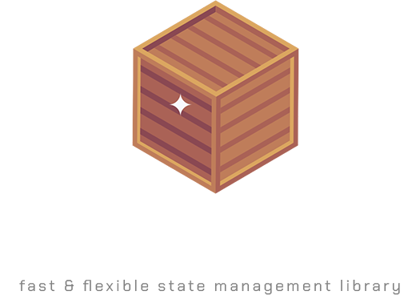

 

<b>
<a href="https://neohertz.dev/docs/crate/about">About</a>
<a> - </a>
<a href="https://neohertz.dev/docs/crate/install">Install</a>
<a> - </a>
<a href="https://neohertz.dev/docs/crate/api">API</a>
<a> - </a>
<a href="https://www.mit.edu/~amini/LICENSE.md">License</a>
<a> - </a>
<a href="https://www.flaticon.com/free-icons/wooden-box">Icon Credit</a>
</b>

<i>(early beta - may be broken)</i>

